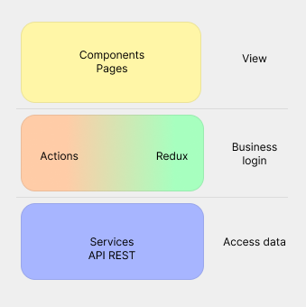
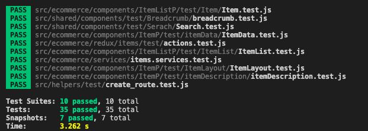

# Meli Frontend Challenge

En la presente carpeta se encuentra el código fuente relacionado al Frontend - Meli Challenge

## Proyecto

Como tecnología y librería principal se encuentra React utilizando Javascript para sacar el máximo potencial de los hooks y demás. Para la gestión de estados se utilizó Redux y en cuanto a testing, se utilizó Jest y Enzyme, los cuales son un magnífica combinación para las pruebas tanto unitarias como de integración

## Arquitectura

El proyecto fue construido utilizando React, con una arquitectura basada en Redux, donde los componentes envían acciones, los cuales generan un estado. Estas acciones pueden llamar a un API-REST (constituido en la carpeta [server](./../server) para así, generar cierto estado y poder consumirlo en cualquier lugar de la aplicación, por algún otro component, por ejemplo.  

Como se puede observar en la imagen superior, diferentes componentes hacen un `disptach` de alguna acción, como por ejemplo el componente `<Item />` al inicializarce, el cual hace un llamado a un API (de acuerdo al párametro de la URL) y de acuerdo a esa respuesta, generar un estado almacenando un Item de manera global, para ser consumido por este mismo componente.

**Es importante mencionar que se realizó de esta forma pensando en la posible inclusión futura de cualquier componente que podría consumir este estado, como por ejemplo, una pasarela de pagos**

En la presente arquitectura también se puede evidenciar la separación de capas que se realiza, con el objetivo de un código mejor estructurado y organizado. Esto permite en un futuro realizar el mantenimiento de una mejor manera, separando cambios en la vista, la lógica, el acceso a datos en diferentes funciones. Todo esto favoreciendo igualmente el fácil testing de la aplicación, siendo posible realizar pruebas atómicas y precisas.

Finalmente, basándose en la arquitectura limpia (clean code) y organizando el código adecuadamente, se estableció tal estructura de carpetas, donde adentrándose en el código, el desarrollador puede saber en que parte de la aplicación de encuentra de manera clara y precisa.

## Testing

Para realizar las pruebas del código, se utilizó Jest, completando exitosamente 35 test:

Se realizaron las pruebas que se consideraban más importantes o que de una u otra forma se relacionaban con la ruta crítica de la aplicación.

## `Coding`

Puedes ejecutiar el proyecto con la siguiente instrución:
`npm start`

Tambien puedes ejecutar las pruebas con la instrución:
`npm test`

#

Made with ❤️ by Santiago 👨🏽‍💻 
